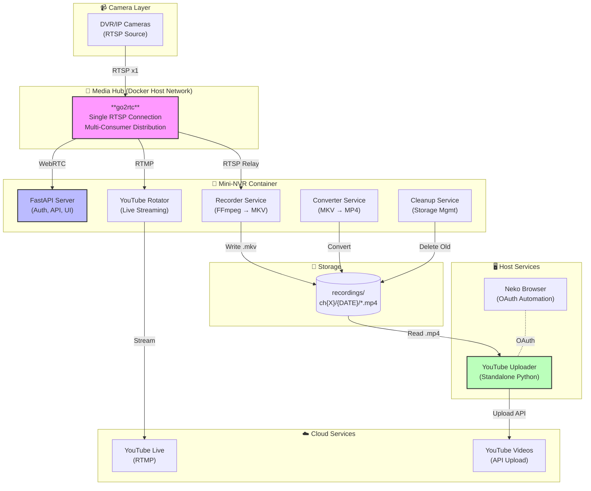
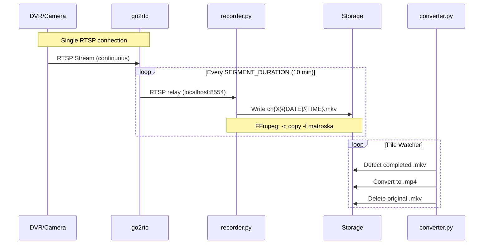
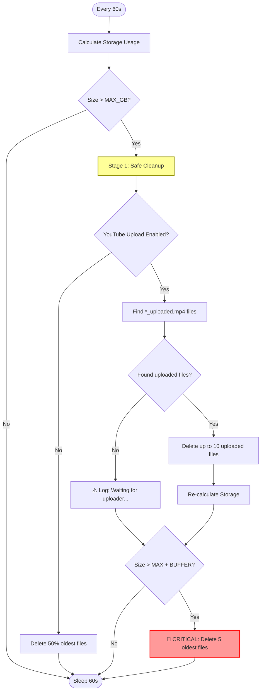
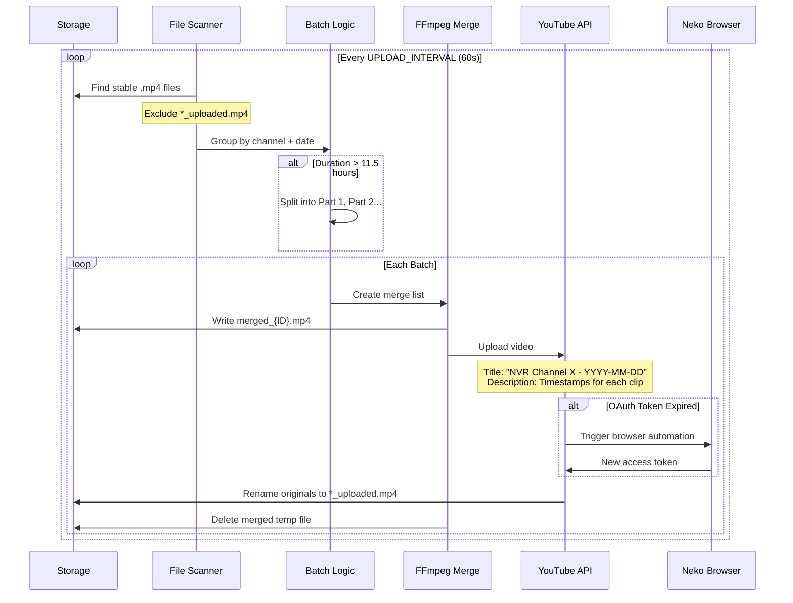
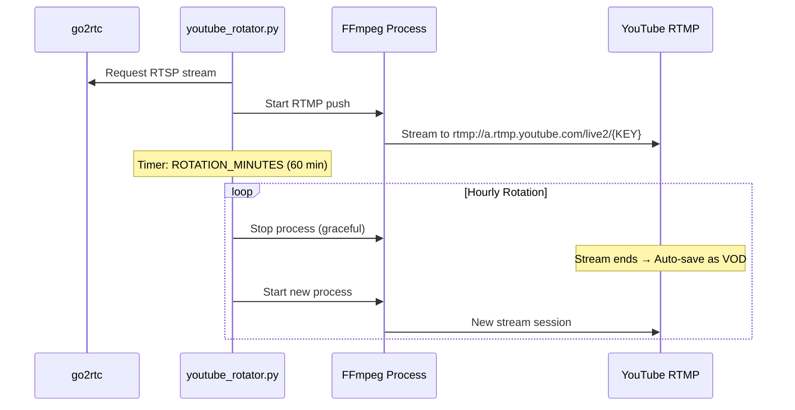
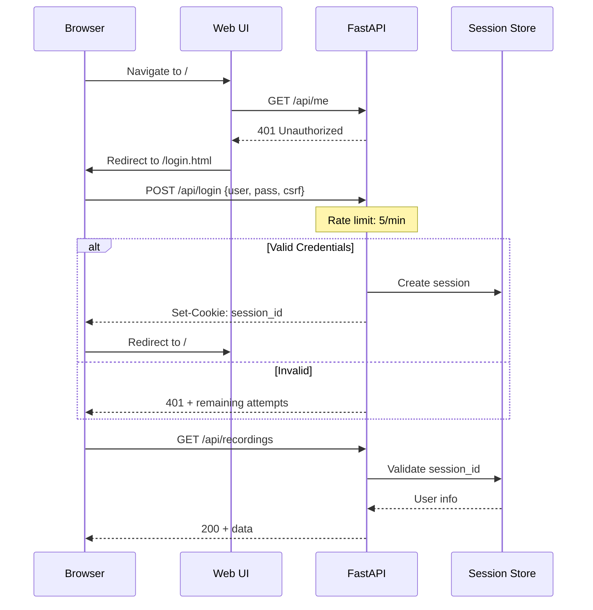
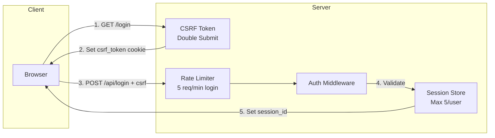

# Mini-NVR Design & Architecture

## System Overview

Mini-NVR is a lightweight, Docker-based Network Video Recorder designed for efficiency and modern integration. It leverages **go2rtc** as a central media hub to minimize connections to camera hardware while offering low-latency WebRTC live viewing, continuous recording, and cloud integration (YouTube Live & Upload).

---

## High-Level Architecture



---

## Core Components

### 1. go2rtc (Media Hub)
| Aspect | Description |
|--------|-------------|
| **Role** | Central hub for all video streams |
| **Function** | RTSP connection pooling, WebRTC transcoding, RTSP relay |
| **Key Benefit** | Single connection per camera → serves multiple consumers |

### 2. Mini-NVR Container
| Service | Description |
|---------|-------------|
| **FastAPI Server** | Web UI, REST API, authentication, session management |
| **Recorder** | Captures RTSP from go2rtc, writes segmented MKV files |
| **Converter** | Background thread: MKV → MP4 using FFmpeg |
| **YouTube Rotator** | Manages live streams with hourly rotation |
| **Cleanup** | Two-stage storage management (upload-aware) |

### 3. YouTube Uploader (Host)
| Aspect | Description |
|--------|-------------|
| **Location** | Runs on host (not Docker) for browser automation |
| **Function** | Batch, merge, and upload MP4s to YouTube |
| **OAuth** | Uses Neko browser for token refresh automation |

---

## Detailed Workflows

### 1. 📹 Recording Pipeline



**Step-by-Step:**
1. **DVR → go2rtc**: Single RTSP connection established per camera
2. **go2rtc → Recorder**: Local RTSP relay on `localhost:8554`
3. **Recorder**: FFmpeg captures stream in 10-minute segments (MKV)
4. **Converter**: Watches for completed MKV files, converts to MP4
5. **File Organization**: `recordings/ch{X}/{YYYY-MM-DD}/{HH-MM-SS}.mp4`

---

### 2. 🧹 Storage Cleanup Pipeline



**Step-by-Step:**
1. **Check**: Calculate total storage usage every 60 seconds
2. **Stage 1 (Soft Limit)**: If over `MAX_STORAGE_GB`:
   - YouTube mode: Delete only `*_uploaded.mp4` files (safe to remove)
   - Standard mode: Delete 50% of oldest files
3. **Stage 2 (Critical)**: If over `MAX_STORAGE_GB + MAX_STORAGE_EXCEED_ALLOWED_GB`:
   - Force delete oldest 5 files regardless of upload status
   - Logs critical warning to prevent system failure

---

### 3. 📤 YouTube Upload Pipeline



**Step-by-Step:**
1. **Scan**: Find all stable MP4 files (not being written)
2. **Filter**: Exclude already-uploaded files (`*_uploaded.mp4`)
3. **Group**: Batch files by Channel + Date
4. **Duration Check**: 
   - If total duration < 11.5 hours → single upload
   - If > 11.5 hours → split into multiple parts
5. **Merge**: FFmpeg concat files into single video
6. **Upload**: Push to YouTube with auto-generated title + timestamps
7. **Finalize**: Rename source files to `*_uploaded.mp4`

---

### 4. 📺 YouTube Live Streaming



**Step-by-Step:**
1. **Configure**: Set stream keys in `.env` (one per channel)
2. **Start**: FFmpeg pushes RTSP → RTMP to YouTube
3. **Rotation**: Every 60 minutes (configurable):
   - Stop current stream (YouTube saves as VOD)
   - Start new stream session
4. **Result**: Each hour becomes a separate archived video on YouTube

---

### 5. 🔐 Authentication Flow



---

## Directory Structure

```
Mini-NVR/
├── 📄 .env                      # Configuration (secrets, settings)
├── 📄 .env.example              # Template configuration
├── 📄 docker-compose.yml        # Container orchestration
├── 📄 Dockerfile                # NVR container build
├── 📄 go2rtc.yaml               # Auto-generated from .env
│
├── 📁 app/                      # Main application
│   ├── server.py                # FastAPI entry point
│   ├── recorder.py              # RTSP recording service
│   ├── cleanup.py               # Storage management
│   ├── 📁 api/
│   │   ├── auth.py              # Login/logout endpoints
│   │   ├── routes.py            # API routes
│   │   └── deps.py              # Dependencies/middleware
│   ├── 📁 core/
│   │   ├── config.py            # Environment config loader
│   │   ├── logger.py            # Logging setup
│   │   └── security.py          # Auth, CSRF, rate limiting
│   └── 📁 services/
│       ├── converter.py         # MKV → MP4 conversion
│       ├── youtube_rotator.py   # Live stream rotation
│       └── store.py             # Recording metadata
│
├── 📁 web/                      # Frontend
│   ├── index.html               # Main viewer page
│   ├── login.html               # Login page
│   ├── 📁 css/                  # Stylesheets
│   └── 📁 js/                   # JavaScript modules
│
├── 📁 youtube_uploader/         # Standalone uploader (host)
│   └── main.py                  # NVRUploaderService class
│
├── 📁 scripts/                  # Setup & control
│   ├── start.sh                 # Main startup script
│   ├── generate-go2rtc-config.sh
│   └── generate-web-config.sh
│
└── 📁 recordings/               # Video storage (Docker volume)
    └── ch{X}/
        └── {YYYY-MM-DD}/
            └── {HH-MM-SS}.mp4
```

---

## Data Flow Summary

| Source | Protocol | Destination | Purpose |
|--------|----------|-------------|---------|
| DVR | RTSP | go2rtc | Stream ingestion |
| go2rtc | WebRTC | Browser | Live view |
| go2rtc | RTSP | recorder.py | Recording |
| go2rtc | RTMP | YouTube | Live streaming |
| Disk | File | converter.py | MKV → MP4 |
| Disk | File | uploader | YouTube upload |

---

## Security Architecture



**Features:**
- ✅ Bcrypt password hashing
- ✅ Session-based authentication (max 5 per user)
- ✅ CSRF protection (Double Submit Cookie)
- ✅ Rate limiting (login: 5 attempts/minute)
- ✅ Input validation on all parameters

---

## Configuration Reference

See [README.md](./README.md#configuration) for complete environment variable reference.
