# Mini-NVR Design & Architecture

## System Overview

Mini-NVR is a lightweight, Docker-based Network Video Recorder designed for efficiency and modern integration. It leverages **go2rtc** as a central media hub to minimize connections to camera hardware while offering low-latency WebRTC live viewing, continuous recording, and cloud integration (YouTube Live & Upload).

---

## High-Level Architecture

```mermaid
graph TB
    subgraph "📹 Camera Layer"
        DVR["DVR/IP Cameras<br/>(RTSP Source)"]
    end

    subgraph "🔄 Media Hub (Docker Host Network)"
        Go2RTC["**go2rtc**<br/>Single RTSP Connection<br/>Multi-Consumer Distribution"]
    end

    subgraph "🐳 Mini-NVR Container"
        Server["FastAPI Server<br/>(Auth, API, UI)"]
        Recorder["Recorder Service<br/>(FFmpeg → MKV)"]
        Converter["Converter Service<br/>(MKV → MP4)"]
        YTRotator["YouTube Rotator<br/>(Live Streaming)"]
        Cleanup["Cleanup Service<br/>(Storage Mgmt)"]
    end

    subgraph "💾 Storage"
        Disk[("recordings/<br/>ch{X}/{DATE}/*.mp4")]
    end

    subgraph "☁️ Cloud Services"
        YTLive["YouTube Live<br/>(RTMP)"]
        YTUpload["YouTube Videos<br/>(API Upload)"]
    end

        Uploader["YouTube Uploader<br/>(Standalone Python)"]
        Neko["Neko Browser<br/>(OAuth Automation)"]
        Tunnel["Cloudflare Tunnel<br/>(Remote Access)"]
    end

    DVR -->|RTSP x1| Go2RTC
    Go2RTC -->|WebRTC| Server
    Go2RTC -->|RTSP Relay| Recorder
    Go2RTC -->|RTMP| YTRotator

    Recorder -->|Write .mkv| Disk
    Converter -->|Convert| Disk
    Cleanup -->|Delete Old| Disk

    YTRotator -->|Stream| YTLive
    Disk -->|Read .mp4| Uploader
    Uploader -->|Upload API| YTUpload
    Neko -.-|OAuth| Uploader
    Tunnel -->|Proxy https| Server

    style Go2RTC fill:#f9f,stroke:#333,stroke-width:2px
    style Uploader fill:#bfb,stroke:#333,stroke-width:2px
    style Server fill:#bbf,stroke:#333,stroke-width:2px
```

---

## Core Components

### 1. go2rtc (Media Hub)
| Aspect | Description |
|--------|-------------|
| **Role** | Central hub for all video streams |
| **Function** | RTSP connection pooling, WebRTC transcoding, RTSP relay |
| **Key Benefit** | Single connection per camera → serves multiple consumers |

### 2. Mini-NVR Container
| Service | Description |
|---------|-------------|
| **FastAPI Server** | Web UI, REST API, authentication, session management |
| **Recorder** | Captures RTSP from go2rtc, writes segmented MKV files |
| **Converter** | Background thread: MKV → MP4 using FFmpeg |
| **YouTube Rotator** | Manages live streams with hourly rotation |
| **Cleanup** | Two-stage storage management (upload-aware) |

### 3. YouTube Uploader (Host)
| Aspect | Description |
|--------|-------------|
| **Location** | Runs on host (not Docker) for browser automation |
| **Function** | Batch, merge, and upload MP4s to YouTube |
    Neko -.-|OAuth| Uploader

### 4. Cloudflare Tunnel (Host Service)
| Aspect | Description |
|--------|-------------|
| **Role** | Secure remote access gateway |
| **Function** | Exposes localhost:web_port to internet without port forwarding |
| **Security** | Zero Trust architecture, Cloudflare Access policy enforcement |

---

## Detailed Workflows

### 1. 📹 Recording Pipeline


**Step-by-Step:**
1. **DVR → go2rtc**: Single RTSP connection established per camera
2. **go2rtc → Recorder**: Local RTSP relay on `localhost:GO2RTC_RTSP_PORT`
3. **Recorder**: FFmpeg captures stream in 10-minute segments (MKV)
4. **Converter**: Watches for completed MKV files, converts to MP4
5. **File Organization**: `recordings/ch{X}/{YYYY-MM-DD}/{HH-MM-SS}.mp4`

---

### 2. 🧹 Storage Cleanup Pipeline


**Step-by-Step:**
1. **Check**: Calculate total storage usage every 60 seconds
2. **Stage 1 (Soft Limit)**: If over `MAX_STORAGE_GB`:
   - YouTube mode: Delete only `*_uploaded.mp4` files (safe to remove)
   - Standard mode: Delete 50% of oldest files
3. **Stage 2 (Critical)**: If over `MAX_STORAGE_GB + MAX_STORAGE_EXCEED_ALLOWED_GB`:
   - Force delete oldest 5 files regardless of upload status
   - Logs critical warning to prevent system failure

---

### 3. 📤 YouTube Upload Pipeline


**Step-by-Step:**
1. **Scan**: Find all stable MP4 files (not being written)
2. **Filter**: Exclude already-uploaded files (`*_uploaded.mp4`)
3. **Group**: Batch files by Channel + Date
4. **Duration Check**: 
   - If total duration < 11.5 hours → single upload
   - If > 11.5 hours → split into multiple parts
5. **Merge**: FFmpeg concat files into single video
6. **Upload**: Push to YouTube with auto-generated title + timestamps
7. **Finalize**: Rename source files to `*_uploaded.mp4`

---

### 4. 📺 YouTube Live Streaming


**Step-by-Step:**
1. **Configure**: Set stream keys in `.env` (one per channel)
2. **Start**: FFmpeg pushes RTSP → RTMP to YouTube
3. **Rotation**: Every 60 minutes (configurable):
   - Stop current stream (YouTube saves as VOD)
   - Start new stream session
4. **Result**: Each hour becomes a separate archived video on YouTube

---

### 5. 🔐 Authentication Flow


---

## Directory Structure

```
Mini-NVR/
├── 📄 .env                      # Configuration (secrets, settings)
├── 📄 .env.example              # Template configuration
├── 📄 docker-compose.yml        # Container orchestration
├── 📄 Dockerfile                # NVR container build
├── 📄 go2rtc.yaml               # Auto-generated from .env
│
├── 📁 app/                      # Main application
│   ├── server.py                # FastAPI entry point
│   ├── recorder.py              # RTSP recording service
│   ├── cleanup.py               # Storage management
│   ├── 📁 api/
│   │   ├── auth.py              # Login/logout endpoints
│   │   ├── routes.py            # API routes
│   │   └── deps.py              # Dependencies/middleware
│   ├── 📁 core/
│   │   ├── config.py            # Environment config loader
│   │   ├── logger.py            # Logging setup
│   │   └── security.py          # Auth, CSRF, rate limiting
│   └── 📁 services/
│       ├── converter.py         # MKV → MP4 conversion
│       ├── youtube_rotator.py   # Live stream rotation
│       └── store.py             # Recording metadata
│
├── 📁 web/                      # Frontend
│   ├── index.html               # Main viewer page
│   ├── login.html               # Login page
│   ├── 📁 css/                  # Stylesheets
│   └── 📁 js/                   # JavaScript modules
│
├── 📁 youtube_uploader/         # Standalone uploader (host)
│   └── main.py                  # NVRUploaderService class
│
├── 📁 scripts/                  # Setup & control
│   ├── generate-go2rtc-config.sh
│   ├── generate-web-config.sh
│   ├── setup-ssh-auth.sh        # SSH setup for Docker-to-host auth triggering
│   ├── setup_cloudflare_tunnel.sh
│   └── reauth.py                # Host-side OAuth script for re-authentication
├── 📄 setup.sh                  # Environment & dependency setup
├── 📄 start.sh                  # Start all services
├── 📄 stop.sh                   # Stop all services
├── 📄 status.sh                 # Check service status
│
└── 📁 recordings/               # Video storage (Docker volume)
    └── ch{X}/
        └── {YYYY-MM-DD}/
            └── {HH-MM-SS}.mp4
```

---

## Data Flow Summary

| Source | Protocol | Destination | Purpose |
|--------|----------|-------------|---------|
| DVR | RTSP | go2rtc | Stream ingestion |
| go2rtc | WebRTC | Browser | Live view |
| go2rtc | RTSP | recorder.py | Recording |
| go2rtc | RTMP | YouTube | Live streaming |
| Disk | File | converter.py | MKV → MP4 |
| Disk | File | uploader | YouTube upload |

---

## Security Architecture


**Features:**
- ✅ Bcrypt password hashing
- ✅ Session-based authentication (max 5 per user)
- ✅ CSRF protection (Double Submit Cookie)
- ✅ Rate limiting (login: 5 attempts/minute)
- ✅ Input validation on all parameters

---

## Edge Cases & Failure Handling

This section documents how each component handles failures, edge cases, and recovery scenarios.

### 1. Recorder Service (`recorder.py`)

| Scenario | Handling | Code Location |
|----------|----------|---------------|
| **FFmpeg crash** | Exponential backoff retry: 2s → 4s → ... → 30s max | `start_camera()` L125-129 |
| **Midnight date rollover** | Detects date change, terminates current process, restarts with new folder | `start_camera()` L72-82 |
| **No output files created** | After running with no MKV/MP4 output, restarts FFmpeg | `start_camera()` L139-146 |
| **go2rtc not available** | Retries connection every 2s until go2rtc starts | `start_camera()` L117-120 |
| **Directory deleted during recording** | Recreates directory every 60s in main loop | `main()` L214 |
| **Process start failure** | Catches exception, logs error, retries after 2s | `start_camera()` L113-120 |

```mermaid
flowchart TD
    Start[Start Recording] --> Check{Process Running?}
    Check -->|No| Spawn[Spawn FFmpeg]
    Spawn -->|Fail| Backoff[Wait 2s × failures<br/>max 30s]
    Backoff --> Spawn
    Spawn -->|Success| Monitor[Monitor Process]
    Check -->|Yes| Monitor
    Monitor -->|Crash| IncrFail[Increment Failures]
    IncrFail --> Backoff
    Monitor -->|No Output| Restart[Terminate & Restart]
    Restart --> Spawn
```



---

### 2. Converter Service (`converter.py`)

| Scenario | Handling | Code Location |
|----------|----------|---------------|
| **Incomplete MKV (still writing)** | Skips files modified < 15 seconds ago | `is_file_stable()` L21-27 |
| **Leftover temp file from crash** | Deletes `.tmp` file before converting | `convert_to_mp4()` L37-42 |
| **Conversion timeout** | 5-minute timeout on FFmpeg subprocess | `convert_to_mp4()` L70 |
| **Empty output file** | Detects zero-byte output, deletes temp, logs warning | `convert_to_mp4()` L77-80 |
| **Atomic file write** | Writes to `.tmp` then `os.rename()` for atomicity | `convert_to_mp4()` L74 |
| **FFmpeg error** | Catches exception, cleans up temp file | `convert_to_mp4()` L82-89 |
| **Scan loop exception** | Caught and logged, loop continues | `run()` L103-104 |

---

### 3. YouTube Rotator (`youtube_rotator.py`)

| Scenario | Handling | Code Location |
|----------|----------|---------------|
| **Initial connection failure** | Retry with exponential backoff: 5s → 10s → ... → 60s max | `run()` L180-186 |
| **Restart failure** | Retries up to 3 times with 5s delay | `_restart_stream()` L157-166 |
| **go2rtc API timeout** | 60s timeout for start, 10s for stop | L105, L138 |
| **Graceful shutdown** | `_stop_event` allows clean thread termination | `stop()` L168-171 |
| **No stream keys configured** | Logs warning, returns empty list | `create_youtube_streamers()` L236-237 |

---

### 4. YouTube Uploader (`youtube_uploader/main.py`)

| Scenario | Handling | Code Location |
|----------|----------|---------------|
| **Upload limit exceeded** | Detects `uploadLimitExceeded` error → sleeps 1 hour | `_process_batch()` L512-514 |
| **Auth token expired** | Resets `_service = None`, triggers re-auth on next attempt | `_process_batch()` L515-516 |
| **File still being written** | Skips files modified < 15 seconds ago | `_is_file_stable()` L240-245 |
| **Duration > 11.5 hours** | Auto-splits batch into multiple "Part X/Y" uploads | `_find_batches()` L327-358 |
| **Merge failure** | Cleans up concat list file, returns None | `_merge_videos()` L411-418 |
| **Missing FFmpeg** | Checks on startup, exits with error | `_check_dependencies()` L127-134 |
| **Graceful shutdown** | SIGINT/SIGTERM handlers call `stop()` | `main()` L635-639 |
| **Single file batch** | Skips merge step, uploads directly | `_merge_videos()` L368-369 |
| **Batch finalization failure** | Logs error but continues to next file | `_finalize_batch()` L221-222, L229-230 |

```mermaid
flowchart TD
    Upload[Upload Video] --> Success{Success?}
    Success -->|Yes| Finalize[Rename to *_uploaded.mp4]
    Success -->|No| CheckErr{Error Type?}
    CheckErr -->|Upload Limit| Sleep1h[🛑 Sleep 1 hour]
    CheckErr -->|Auth Error| ResetAuth[Reset service, retry auth]
    CheckErr -->|Other| Log[Log error, continue]
    Sleep1h --> Retry[Retry batch]
    ResetAuth --> Retry
```



---

### 5. Cleanup Service (`cleanup.py`)

| Scenario | Handling | Code Location |
|----------|----------|---------------|
| **Storage over soft limit** | Stage 1: Delete only `*_uploaded.mp4` files (safe) | `main()` L56-67 |
| **No uploaded files to delete** | Logs warning, waits for uploader to catch up | `main()` L64-65 |
| **Storage critical (over hard limit)** | Stage 2: Delete ANY 5 oldest files | `main()` L96-110 |
| **Empty directory after deletion** | Removes empty parent directory | `main()` L89-91 |
| **File deletion error** | Catches OSError, logs warning, continues | `main()` L92-93 |

---

### 6. Security & Authentication (`security.py`, `auth.py`)

| Scenario | Handling | Code Location |
|----------|----------|---------------|
| **Login brute force** | Rate limited to 5 attempts/minute per IP | `auth.py` L13 |
| **Session limit exceeded** | Evicts oldest session when > 5 per user | `security.py` L57-58 |
| **Session file corrupted** | Falls back to empty sessions dict | `security.py` L30-31 |
| **Atomic session save** | Writes to `.tmp` then `os.rename()` | `security.py` L37-40 |
| **Thread safety** | All session operations protected by `_session_lock` | `security.py` L20, L52, L64, L70 |
| **Bcrypt hash fallback** | Supports both hashed and plaintext passwords | `auth.py` L20-24 |
| **Invalid bcrypt hash** | `verify_password()` catches ValueError/TypeError | `security.py` L84-85 |

---

## Configuration Reference

See [README.md](./README.md#configuration) for complete environment variable reference.
